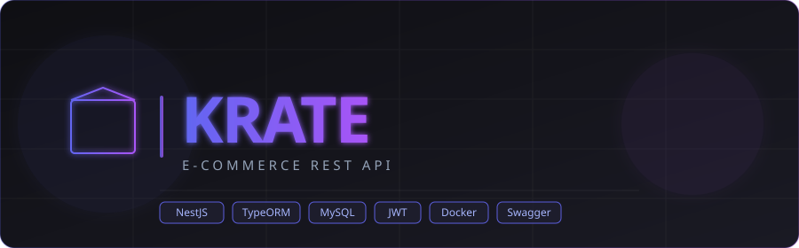

<p align="center">
  
</p>

<p align="center">
  
  
  
  
  
  
  
</p>

---

**Krate** es una API REST de e-commerce construida con arquitectura hexagonal sobre NestJS. Gestiona usuarios, productos, órdenes y pagos, exponiendo endpoints RESTful consumibles por cualquier cliente. Proyecto de portafolio orientado a producción.

## Arquitectura

El proyecto implementa **arquitectura hexagonal** (ports & adapters) organizada por módulo. Cada módulo está dividido en cuatro capas estrictas:

```
src/
├── shared/                        # Transversal: guards, decorators, ports comunes
│   ├── domain/value-objects/
│   ├── application/ports/
│   ├── infrastructure/services/
│   └── presentation/
│
├── {módulo}/
│   ├── domain/                    # Entidades puras TypeScript + repository ports
│   ├── application/               # Casos de uso, servicios, DTOs internos
│   ├── infrastructure/            # TypeORM: OrmEntity, Mapper, Repository impl.
│   └── presentation/              # Controller + DTOs HTTP (request/response)
```

Las capas `domain` y `application` no tienen dependencias de NestJS, TypeORM ni Express. Los repositorios se inyectan mediante `abstract class` como token de port.

## Stack

| Categoría | Tecnología |
|---|---|
| Runtime | Node.js 20 LTS · NestJS 10 · TypeScript 5 |
| Base de datos | MySQL 8.0 · TypeORM 0.3 |
| Autenticación | JWT (access 15min + refresh 7d) · Passport.js · bcrypt (12 rounds) |
| Validación | class-validator · class-transformer · ValidationPipe global |
| Seguridad | Helmet · CORS · Rate limiting (60 req/min) · Refresh tokens hasheados |
| Documentación | Swagger / OpenAPI 3 — `/api/docs` |
| DevOps | Docker · docker-compose · GitHub Actions CI |

## Módulos

| Módulo | Descripción |
|---|---|
| **Auth** | Registro, login, logout, refresh de token |
| **Users** | Gestión de perfil y roles (admin / customer) |
| **Categories** | CRUD con relación padre-hijo |
| **Products** | CRUD con stock, filtros, paginación y soft delete |
| **Cart** | Carrito por sesión de usuario |
| **Orders** | Creación desde carrito con transacciones atómicas |
| **Payments** | Registro de pago con actualización automática de estado |
| **Admin** | Reportes de ventas y estadísticas restringidos a admin |

## Instalación

### Prerrequisitos

- Node.js 20+
- Docker y docker-compose

### Configuración

```bash
git clone https://github.com/shdez-dev/krate-api.git
cd krate-api
```

Configura el archivo `.env` con tus credenciales (ver sección de variables de entorno).

### Levantar con Docker (solo MySQL) + app local

```bash
docker-compose up mysql -d
npm install
npm run start:dev
```

### Seed de datos

Crea 1 admin, 3 categorías y 10 productos de demo:

```bash
npm run seed
```

Credenciales del admin creado por el seed:

```
email:    admin@krate.dev
password: Admin1234!
```

### Levantar todo con Docker

```bash
docker-compose up -d
```

---

La API queda disponible en `http://localhost:3000`
Swagger UI en `http://localhost:3000/api/docs`

## Variables de entorno

| Variable | Descripción | Ejemplo |
|---|---|---|
| `DB_HOST` | Host de MySQL | `localhost` |
| `DB_PORT` | Puerto de MySQL | `3306` |
| `DB_NAME` | Nombre de la base de datos | `krate_db` |
| `DB_USER` | Usuario de MySQL | `root` |
| `DB_PASS` | Contraseña de MySQL | `secret` |
| `JWT_SECRET` | Clave de firma del access token | `supersecret` |
| `JWT_REFRESH_SECRET` | Clave de firma del refresh token | `refreshsecret` |
| `JWT_EXPIRES_IN` | Duración del access token | `15m` |
| `JWT_REFRESH_EXPIRES` | Duración del refresh token | `7d` |
| `PORT` | Puerto de la aplicación | `3000` |

## Uso de la API

### Autenticación

Todos los endpoints protegidos requieren el header:

```
Authorization: Bearer <accessToken>
```

**Registro**

```http
POST /auth/register
Content-Type: application/json

{
  "email": "user@example.com",
  "password": "StrongPass123",
  "firstName": "Sebastian",
  "lastName": "Hernandez"
}
```

**Login**

```http
POST /auth/login
Content-Type: application/json

{
  "email": "user@example.com",
  "password": "StrongPass123"
}
```

Respuesta:

```json
{
  "accessToken": "eyJ...",
  "refreshToken": "eyJ..."
}
```

**Refresh token**

```http
POST /auth/refresh
Content-Type: application/json

{
  "refreshToken": "eyJ..."
}
```

**Logout**

```http
POST /auth/logout
Authorization: Bearer <accessToken>
```

---

### Endpoints

| Método | Ruta | Auth | Descripción |
|---|---|---|---|
| `POST` | `/auth/register` | — | Registro de usuario |
| `POST` | `/auth/login` | — | Login |
| `POST` | `/auth/refresh` | — | Renovar access token |
| `POST` | `/auth/logout` | JWT | Cerrar sesión |
| `GET` | `/users/me` | JWT | Perfil del usuario |
| `PUT` | `/users/me` | JWT | Actualizar perfil |
| `GET` | `/categories` | — | Listar categorías |
| `GET` | `/categories/:id` | — | Detalle de categoría |
| `POST` | `/categories` | ADMIN | Crear categoría |
| `PUT` | `/categories/:id` | ADMIN | Actualizar categoría |
| `DELETE` | `/categories/:id` | ADMIN | Eliminar categoría |
| `GET` | `/products` | — | Listar productos (con filtros) |
| `GET` | `/products/:id` | — | Detalle de producto |
| `POST` | `/products` | ADMIN | Crear producto |
| `PUT` | `/products/:id` | ADMIN | Actualizar producto |
| `DELETE` | `/products/:id` | ADMIN | Soft delete de producto |
| `GET` | `/cart` | JWT | Ver carrito |
| `POST` | `/cart/items` | JWT | Agregar ítem al carrito |
| `PATCH` | `/cart/items/:id` | JWT | Actualizar cantidad |
| `DELETE` | `/cart/items/:id` | JWT | Eliminar ítem |
| `DELETE` | `/cart` | JWT | Vaciar carrito |
| `GET` | `/orders` | JWT | Historial de órdenes |
| `GET` | `/orders/:id` | JWT | Detalle de orden |
| `POST` | `/orders` | JWT | Crear orden desde carrito |
| `PATCH` | `/orders/:id/status` | ADMIN | Cambiar estado de orden |
| `POST` | `/payments` | JWT | Registrar pago |
| `GET` | `/payments/order/:orderId` | JWT | Pago de una orden |
| `GET` | `/admin/stats` | ADMIN | Estadísticas de ventas |

### Filtros de productos

`GET /products` acepta los siguientes query params:

| Param | Tipo | Descripción |
|---|---|---|
| `name` | string | Busca por nombre (LIKE) |
| `categoryId` | uuid | Filtra por categoría |
| `minPrice` | number | Precio mínimo |
| `maxPrice` | number | Precio máximo |
| `limit` | number | Resultados por página (default: 10) |
| `offset` | number | Desplazamiento (default: 0) |

Ejemplo:

```http
GET /products?categoryId=uuid&minPrice=50&maxPrice=500&limit=5&offset=0
```

### Flujo de compra

```
1. POST /auth/login              → obtener tokens
2. POST /cart/items              → agregar productos al carrito
3. POST /orders                  → crear orden (descuenta stock automáticamente)
4. POST /payments                → registrar pago (cambia orden a "paid")
```

### Estados de una orden

```
pending → paid → shipped → delivered
                ↓
            cancelled
```

### Errores

Todos los errores siguen el mismo formato:

```json
{
  "statusCode": 404,
  "message": "Producto no encontrado",
  "timestamp": "2026-05-20T00:00:00.000Z"
}
```

## Testing

```bash
npm run test        # Unit tests
npm run test:cov    # Con cobertura
npm run test:e2e    # E2E
```

---

<p align="center">
  Desarrollado por <a href="https://github.com/shdez-dev">Sebastian Hernandez</a>
</p>
